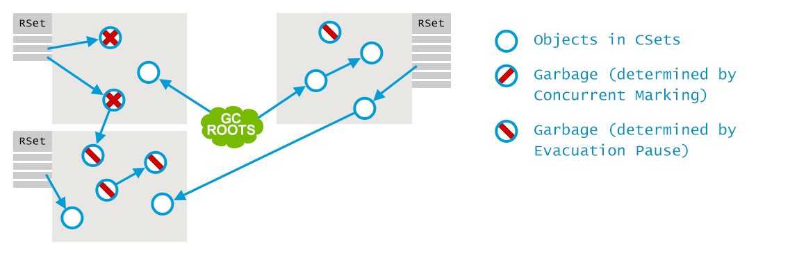

# Garbage Collection

[TOC]

## 历史
内存资源（内存地址资源）是有限资源。在程序运行过程中，如何回收空闲内存地址以便提供代码和数据的后续使用，是一个持续挑战的问题。

### 人工内存管理
#### 1. 传统的malloc/free

```C
int send_request() {
    size_t n = read_size();
    int *elements = malloc(n * sizeof(int));

    if(read_elements(n, elements) < n) {
        // elements not freed!
        return -1;
    }

    // …

    free(elements)
    return 0;
}
```

- 优点：灵活。
- <font color=red>缺点：传统的人工内存管理挑战程序员对代码内存资源的敏感意识，容易导致内存问题，包括内存泄漏、重复释放等。</font>

#### 2. 智能指针
```C++
int send_request() {
    size_t n = read_size();
    vector<int> elements = vector<int>(n);

    if(read_elements(elements.size(), &elements[0]) < n) {
        return -1;
    }

    return 0;
}
```

- 优点：智能指针通过将指针封装成局部对象，当程序离开局部对象的scope时，局部对象会借助析构函数释放指向的内存地址。
- 缺点：<font color=red>人工选择智能指针；不能处理复杂场景。比如当应用需要共享对象时，尤其是多线程环境。</font>

#### 3. 共享指针
```C++
int send_request() {
    size_t n = read_size();
    auto elements = make_shared<vector<int>>();

    // read elements

    store_in_cache(elements);

    // process elements further

    return 0;
}
```
- 优点：升级封装的智能指针，允许对象被共享访问；借助构造函数和析构函数自动管理共享指针的引用计数，当计数为0时自动释放地址。
- <font color=red>缺点：人工选择共享指针</font>。

### 自动内存管理
上述方法都需要程序员参与选择对于何种对象需要使用何种指针。如果对于所有对象，都借助运行时实现自动内存管理，则程序员不再需要考虑这些细节。这称为垃圾回收。第一代垃圾回收器源自1959年的LISP程序语言。

#### 1. Reference Counting 引用计数
引用计数的思路是将共享指针应用到所有的对象。如下图所示，绿色部分表示程序员正在直接使用的对象（或者说直接活跃对象），成为GC roots。从技术处理来说，这些通常是局部变量或者静态变量，作为识别引用的入口或根。这些对象可能会进一步引用其他的对象，这些对象也是活跃对象，图中标注为蓝色。没有任何引用或指针可以到达的对象，则是无法访问的对象，可以认为是垃圾，所以其占用的地址资源应该被回收，图中标注为灰色。


- 优点：简单直观。
- <font color=red>缺点：不能识别循环引用导致的垃圾，导致内存泄漏。</font>
- 改进：单独处理循环引用。
- 使用：Perl, Python, PHP.

#### 2. Mark and Sweep 标记-清除算法
- Marking: 从GC roots出发，遍历所有可达对象，并标记为可达（即活跃）
- Sweeping：扫描全部堆对象，将为标记为可达的对象的地址回收。

- 优点：可以消除循环引用导致的内存泄漏。
- <font color=red>缺点：应用线程需要停下来等待GC线程完成，因为应用线程会修改引用图；而GC需要遍历整个堆区域。</font>
- 使用：Java. 

## JVM中的GC
在真实环境下的GC，需要考虑更多的问题。
### 1. 碎片化
如同所有存储管理（内存管理、磁盘管理、家务整理），碎片化终将不可避免。碎片化的副作用包括：

- 碎片化导致内存利用率下降。
- 因为需要查找合适大小的连续地址空间，内存分配也会变慢。
- <font color=green>一定需要连续地址空间吗？？？</font>
- 解决方案：<font face="黑体" color=blue size=4>mark-sweeping + compact</font>


### 2. 分代假设

- 假设1: 绝大部分对象很快就会变得无用（聘用制？）
- 假设2: 剩下的通常会活很久（有编制？）

基于该假设，可以将内存区域划分成年轻代（B岗？）和老年代（A岗？）。


- 优点：针对A岗和B岗的特点进行优化，回收过程中不用遍历整个堆区域，而只用处理年轻代。
- <font color=red>缺点：代际之间交叉引用；对于活跃期居于A岗和B岗之间的对象，性能很差。</font>

### 3. 内存划分
JVM中的堆区域划分成Young区域（包括Eden、Survivor1、Survivor2）和Old区域。


- Eden: 创建对象时使用的区域。Eden被划分成多个Thread Local Allocation Buffer (TLAB)，以便支持不同线程之间独立分配堆区域而不需要同步；当TLAB不够时，则在共享的Eden区域分配；如果还不够，则对Young区域进行GC；如果还不够，则在Old区域分配。在对Young区域进行GC时，如果有Old区域引用Young区域，则利用<font color=blue>card marking</font>方法处理，以避免全局GC。在对Young区域GC时，所有的活跃对象都被拷贝到一个survior空间，所以GC算法为：Marking-Sweeping + Copy。
- Survivor：有两个survivor空间，分别称为from和to。From和To保持一个为空，用于在下次GC时存储所有的Young区域活跃对象（包括Eden和From）；之后，Eden和From清空，分别用于准备新的分配和准备下次GC存储。如此反复多次之后，仍然活跃的对象被拷贝到Old区域。
- Old：Old区域通常非常大，其GC频率要低很多。其GC算法需要考虑碎片问题，所以为：Marking-Sweeping + Compact.
- Metaspace：主要用于存储class definition。

### 4. GC阶段
- Minor GC: 即Eden区域的GC。新对象不够时触发；GC roots只需考虑从Old到Young引用（否则会错误），不需考虑从Young到Old的引用（Old区域不变）；全局停顿，时长取决于copy的活跃对象的成本。
- Major GC or Full GC：即Old区域的GC。因Old区域非常大，所以是影响全局停顿的主要因素。

## JVM中的GC:实现
### 1. Serial GC
全局停顿，单线程GC
### 2. Parallel GC
全局停顿，多线程GC可以加快GC阶段
### 3. Concurrent Mark and Sweep
目标：不用全局停顿，大部分GC工作与应用线程并发，所以减少停顿时间。

思路：

- Major GC不进行compact，而使用空闲指针，以避免major GC的长停顿。
- 尽量与应用线程并发。

包括7个阶段：

- Inital Mark phase: 全局停顿。搜集GC roots，包括Young对Old的引用。

- Concurrent Mark： 与应用线程并发执行，遍历Old区域，标记活跃对象。注：由于与应用线程并发，不能保证标记Old区域所有的活跃对象。
- Concurrent Preclean: 与应用线程并发执行，补充标记Concurrent Mark阶段被修改的引用导致的活跃对象。Card marking方法。
- Concurrent Abortable Preclean: 与应用线程并发执行，尽量减轻下一步工作量。
- Final Remark：全局停顿，最终标记完整版的活跃对象。
- Concurrent Sweep：与应用线程并发执行，清除阶段。
- Concurrent Reset: 并发，重置数据结构，预备下次GC。

优缺点： 

- 优点： 减少停顿时间。
- 缺点：Old区域的碎片化；停顿时间不可预测；吞吐量通常弱于Parallel GC。

### 4. G1算法
目标：让全局停顿时间可预测、可管理，从而实现软实时GC：在给定时间片内，停顿时间<font color=blue>尽量</font>不超过指定比例。

思路：

- 将Young区域和Old区域进一步划分成小块（典型值为2048），每个小块可以是Eden、Survivor或Old区域。这样，可以进行增量回收，每次值回收2048块的一个子集（包括所有Young小块和部分Old小块）。
- 在增量回收过程中，优先回收含有最多垃圾对象的小块。


1. Evacuation Pause: Fully Young


全局停顿，GC线程间并行，将Young区的活跃对象拷贝到survivor区（任何空闲的Young区都可视为Survivor区）。同时完成部分Old区的Initial Mark工作。


2. Concurrent Marking

	- Initial Mark: 短时全局停顿，用来标记所有从GC roots可达的对象，部分工作在前面的Evacuation Pause阶段已完成。
	- Root Region Scan: 当前实现中是扫描Survivor区域可达的活跃对象。
	- Concurrent Mark: 与CMS类似，遍历所有活跃对象，并在位图中标记。为了确保一致性，在此期间应用线程对对象引用的更新不能影响正分析的引用图。利用称为<font color=blue>Pre-Write barriers</font>的技术，每次有更新时，就将先前被引用对象保存在缓冲区备份，供Concurrent Marking线程使用。
	- Remark: 全局停顿，与CMS类似，完成标记过程。将前阶段因为应用线程并发更新导致的活跃对象标记出来。
	- Cleanup: 绝大部分并发。为后续做准备，计算所有活跃对象，对各小区垃圾密集程度排序；回收全垃圾小块。
	
3. Evacuation Pause: Mixed

如果上述的Cleanup阶段不能很好地回收Old区域，就需要一次混合回收，同时回收Young区域和Old区域。该回收过程会根据标记阶段的排序，以及软实时性能指标来选择回收小块集（collection set）；为了支持增量回收，利用remembered set技术来识别和处理来自外部的引用，就像在CMS中引入card table计算机一样。注意，前面marking阶段识别出的垃圾对象导致的外部引用可以忽略。


回收过程跟CMS类似，利用并行GC线程识别活跃对象，并将活跃对象拷贝到survivor小块，并回收原来的小块。

为了维护remembered sets，在运行时，利用称为<font color=blue>Post-Write Barrier</font>的技术，跟踪每个写操作，进而记录跨小块的引用。该技术会导致性能瓶颈，所以需要异步和别的优化。


### 5. Shenandoah
非分代算法；并发copy；面向多核、大堆场景。

https://rkennke.wordpress.com/

https://plumbr.io/handbook/garbage-collection-algorithms-implementations#shenandoah


